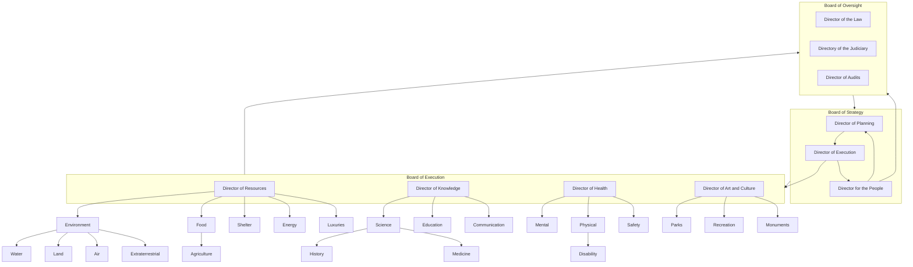

# Organizational Structure

The organization shall be directed by three boards:

1. The _**Board of Strategy**_ shall define the strategic goals of the organization. It shall be componed of a _**Director of Planning**_, a _**Director of Execution**_, and a _**Director of Oversight**_. It be led by the _**Director of Planning**_.
2. The _**Board of Execution**_ shall direct the execution of the strategic goals of the organization and shall be led by the _**Director of Execution**_.
3. The _**Board of Oversight**_ shall ensure that the organization is adhering to our Core Values and applicable internal and external laws. It shall be led by the _**Director of Oversight**_.

